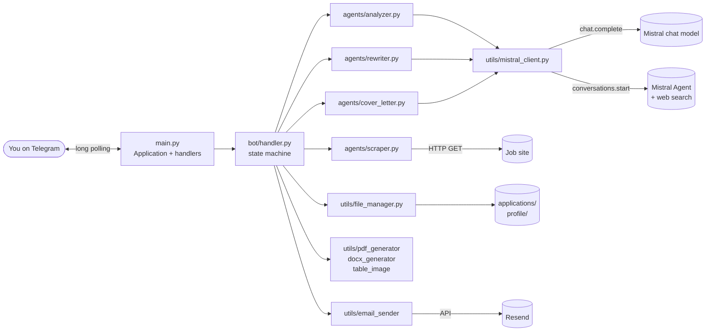
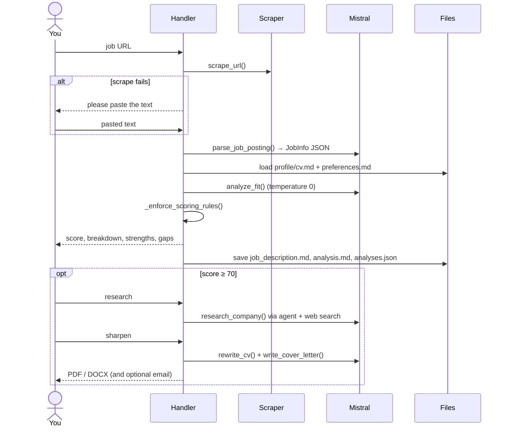
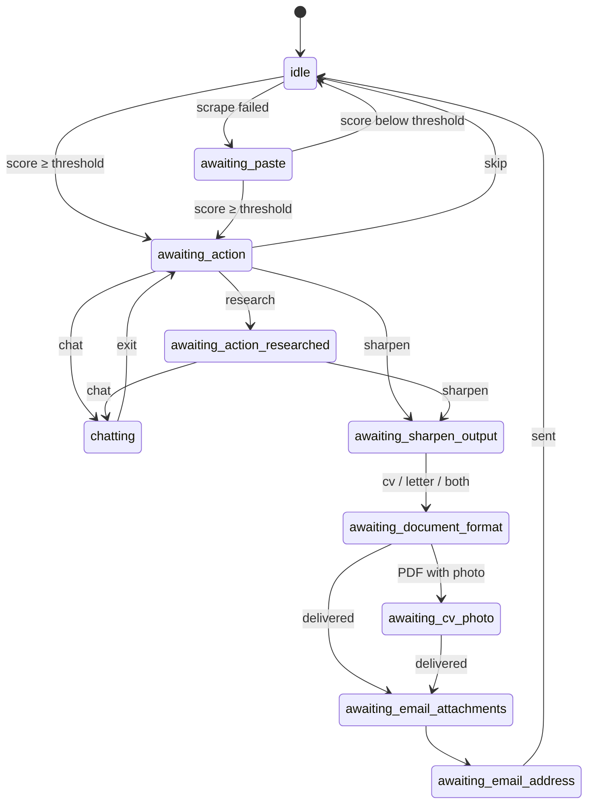

# MakeTheCut ✂️

**Stop wasting time on jobs that aren't a real fit.**

MakeTheCut is a personal job-hunting assistant that lives in Telegram. Paste a job link, and in under a minute you get an honest, evidence-based fit score against *your* CV and *your* preferences. Only when a role is worth your time does it help you go further: researching the company, tailoring your CV, and drafting a cover letter in the language of the posting.

> It never flatters you. A missing requirement is a gap, not a "maybe". Most real matches are partial, and an 85 has to be earned.

---

## What you get

| | |
|---|---|
| 🎯 **A fit score you can trust** | 0–100, built from four transparent components. Hard dealbreakers cap the score at 49, whatever else is in the posting. |
| 🧭 **The full picture, not just a number** | Strengths with CV evidence, gaps and how much they matter, red flags, and a check of each of your stated preferences. |
| 🔍 **Job-description lie detector** | Flags internal contradictions in the posting, such as "entrepreneurial mindset" next to "follow established processes". |
| 🏢 **Company research on demand** | Size, culture, recent news, competitors and employee sentiment, pulled live with web search. |
| ✍️ **A CV tailored per role** | Reorders and rephrases to echo the job's language. **It never invents a skill, role or date.** |
| 💌 **A cover letter that doesn't read like one** | 3–4 specific paragraphs, written in the posting's language (French, German, Spanish and others), addressed to the hiring manager when one is named. |
| 💬 **Chat about the job** | Ask about salary, risks, culture or how to position yourself, with the whole analysis as context. |
| 📄 **PDF or Word, delivered anywhere** | Download from Telegram or email the package to yourself through Resend. |
| 🗂️ **A searchable memory of every job** | `/list` shows a table of every role you've scored. `/ask` answers questions across all of them. |

---

## A quick tour

```text
You:  https://jobs.example.com/senior-product-manager

Bot:  📄 Reading and parsing the job posting...
      🔎 Found: Senior Product Manager at Example Corp
      📖 Reading your CV and preferences...
      ⭐ Rating job fit...

      Fit score: 78 / 100
        Must-have requirements          33 / 40
        Experience & seniority          24 / 30
        Preferences & logistics         14 / 20
        Responsibilities & nice-to-have  7 / 10

      ✅ Strengths   ⚠️ Gaps   🚩 Red flags   🔀 Inconsistencies in the posting
      💡 Recommendation ...

      Reply: sharpen · research · chat · or anything else to skip

You:  sharpen
Bot:  ✅ Tailored CV + cover letter ready. Reply: cv · letter · both
You:  both
Bot:  📎 PDF or Word?  …   (then optionally: email it to yourself)
```

**Score bands:** ≤40 Poor · 41–55 Weak · 56–69 Below bar · 70–79 Moderate · 80–89 Good · 90–100 Excellent.
The default threshold to unlock sharpen (CV + cover letter) is **70** (configurable).

### Commands

| Command | What it does |
|---|---|
| *(send a job URL)* | Scrape → parse → score. If the page can't be scraped, the bot asks you to paste the text. |
| `sharpen` / `research` / `chat` | Replies after a score. Tailor your application, research the company, or discuss the job. |
| `/list` | Table image of every analysed job. Use `/list text` for plain text. |
| `/ask <question>` | Ask across all saved analyses, e.g. *"which job had the best salary?"* |
| `/email` | Email the latest CV and cover letter through Resend. |
| `/continue` | Shows what the bot is waiting for if it seems stuck. |
| `/reset` | Clears the current session and returns to idle. |
| `/help`, `/start` | Usage guide. |

---

## Installation

### Prerequisites

- **Python 3.10+** on macOS or Linux. The bundled launcher uses `.venv/bin/...` paths, so Windows users should create the venv manually.
- A **Telegram bot token** from [@BotFather](https://t.me/botfather).
- Your **Telegram user ID** from [@userinfobot](https://t.me/userinfobot). It will be used for the planned access restriction.
- A **Mistral API key** from [console.mistral.ai](https://console.mistral.ai).
- *(Optional, for company research)* a **Mistral Agent** with the web-search tool enabled. Create one in Mistral AI Studio and copy its agent ID.
- *(Optional, for emailing results)* a **[Resend](https://resend.com)** API key.

### 1. Get the code

```bash
git clone https://github.com/fredbuildsai/MakeTheCut.git
cd MakeTheCut
```

### 2. Configure your credentials

```bash
cp .env.example .env
```

Edit `.env`:

```ini
# Required
TELEGRAM_BOT_TOKEN=123456789:ABCdef...
AUTHORIZED_USER_ID=123456789
MISTRAL_API_KEY=your_mistral_key

# Optional
MISTRAL_MODEL=mistral-medium-latest   # default
MISTRAL_AGENT_ID=ag_...               # enables "research" and web search
MISTRAL_SDK_TIMEOUT=45000             # ms

RESEND_API_KEY=re_...                 # enables emailing
RESEND_FROM=onboarding@resend.dev
RESEND_TO=you@example.com
```

`.env` is git-ignored. Never commit it.

### 3. Write your profile

The `profile/` folder is git-ignored because it is personal. Create it with two files:

- **`profile/cv.md`** is your full CV in Markdown. This is the only source of truth the bot may use. If it contains a Markdown image reference, the bot asks you to send a photo when generating a PDF.
- **`profile/preferences.md`** says what you want and don't want: location and remote policy, salary, seniority, industries, values, deal-breakers. The more specific you are, the sharper the scoring.

### 4. Run it

```bash
python jobbot.py
```

`jobbot.py` is the one-command launcher. It runs `setup.py`, which creates `.venv` and installs `requirements.txt` only when they changed, then starts `main.py`.

To do it by hand:

```bash
python -m venv .venv && source .venv/bin/activate
pip install -r requirements.txt
python main.py
```

The bot uses Telegram long-polling, so you don't need a server, webhook or open port. Keep the process running while you use it and press **Ctrl+C** to stop. Open your bot in Telegram and send `/start`.

### Configuration reference

| Setting | Where | Default |
|---|---|---|
| Fit threshold for sharpen | `config.py` → `FIT_THRESHOLD` | `70` |
| Dealbreaker score cap | `agents/analyzer.py` → `_DEALBREAKER_CAP` | `49` |
| Component weights | `agents/analyzer.py` → `_COMPONENT_CAPS` and `models.ScoreBreakdown` | 40 / 30 / 20 / 10 |
| Model | `.env` → `MISTRAL_MODEL` | `mistral-medium-latest` |
| Timeouts | `config.py` → `MISTRAL_SDK_TIMEOUT`, `AGENT_CALL_TIMEOUT`, `CHAT_CALL_TIMEOUT` | 45 s / 50 s / 30 s |
| Chat memory window | `bot/handler.py` → `_CHAT_MAX_EXCHANGES` | 10 exchanges |

### Troubleshooting

| Symptom | Fix |
|---|---|
| Scraping fails (LinkedIn, Workday, Greenhouse…) | These sites block bots or need JavaScript. Paste the posting text when the bot asks. |
| `CV not found` | Create `profile/cv.md` and `profile/preferences.md`. |
| Telegram `Unauthorized` | Wrong or revoked `TELEGRAM_BOT_TOKEN`. |
| `research` fails | Set `MISTRAL_AGENT_ID` to an agent with web search enabled. |
| Stuck mid-flow | Send `/continue` to see what it expects, or `/reset`. |
| Slow or timing out | Raise `MISTRAL_SDK_TIMEOUT` in `.env`. |

---

## Architecture

MakeTheCut is a small, single-user, locally run Python app. A Telegram message handler drives a state machine. It calls focused "agent" modules, which call Mistral through one thin client, and results are persisted to plain files.

### System overview



### Request pipeline



### Conversation state machine

The bot holds one in-memory session (`_state` in `bot/handler.py`) and routes each message by `status`:



`/reset` returns to `idle` from any state and `/continue` explains what the current state is waiting for.

### Components

| Module | Responsibility |
|---|---|
| `main.py` | Entry point. Registers Telegram handlers, syncs bot description and commands on startup, writes the JSON schema, starts polling. |
| `jobbot.py` / `setup.py` | Launcher. `setup.py` builds `.venv` and reinstalls dependencies only when the `requirements.txt` hash changes. |
| `config.py` | Loads `.env` and holds constants (threshold, timeouts, paths). Creates `profile/` and `applications/` on import. |
| `models.py` | Pydantic models: `JobInfo`, `FitAnalysis`, `ScoreBreakdown`, `ApplicationRecord`, `QARecord`. |
| `bot/handler.py` | The state machine and all Telegram I/O: pipeline orchestration, chat mode, `/list`, `/ask`, `/email`, document and photo flow. |
| `agents/scraper.py` | `requests` + BeautifulSoup. Strips boilerplate, prefers `<main>`/`<article>`/job-like containers, caps text at 15k characters, and reports failure so the user can paste instead. |
| `agents/analyzer.py` | Job parsing, fit scoring, company research and cross-analysis Q&A (`ask_agent`). |
| `agents/rewriter.py` | CV tailoring under a no-invention rule. |
| `agents/cover_letter.py` | Cover letter in the posting's language, using the top strengths and the named contact. |
| `utils/mistral_client.py` | `simple_chat()` for plain completions and `agent_chat()` for the web-search agent, with lazy client init and retry. |
| `utils/file_manager.py` | Loads profile files, creates dated application folders, and upserts `analyses.json`, `qa_log.json` and `conversations.csv`. |
| `utils/pdf_generator.py`, `docx_generator.py` | Markdown → PDF (fpdf2) and Markdown → Word (python-docx). |
| `utils/table_image.py` | Renders the `/list` table as an image with Pillow. |
| `utils/email_sender.py` | HTML email with optional attachments via Resend. |

### Design decisions

- **Scores are computed by code.** The model proposes four component scores. `_enforce_scoring_rules()` clamps each to its range, re-sums them, and applies the dealbreaker cap (49). The final number follows a rule instead of being a model guess.
- **Deterministic analysis.** Scoring runs at `temperature=0` with a strict recruiter persona ("unstated means absent").
- **Honest tailoring.** The rewriter may reorder, rephrase and re-emphasise. It may not add skills, experience or dates.
- **Scoring needs no web search.** Only company research uses the agent, so a normal run is fast and cheap.
- **Graceful degradation.** Scrape failure → paste. Unparseable model output → a safe fallback record. Optional services (agent, Resend) simply disable their feature when unset.
- **Local-first.** Everything runs on your machine. The only outbound calls are to the job site, Mistral, Telegram and (optionally) Resend. Blocking work runs in threads (`asyncio.to_thread`) so the bot stays responsive.
- **Plain files as the database.** No server or migrations. Everything is human-readable and diffable.

### Data model & storage

```text
profile/                      # yours, git-ignored
├── cv.md
└── preferences.md

applications/                 # generated, git-ignored
├── analyses.json             # every ApplicationRecord (upserted by id)
├── analyses.schema.json      # regenerated from models.py on start and on every write
├── qa_log.json               # /ask history
├── conversations.csv         # message log
└── 2026-06-17_Acme_Corp_Senior_Engineer/
    ├── job_description.md    # parsed posting as JSON
    └── analysis.md           # full fit analysis
```

An `ApplicationRecord` holds the source URL, the folder name, a `JobInfo` (company, role, location, requirements, contact, language…), a `FitAnalysis` (score, `ScoreBreakdown`, dealbreakers, inconsistencies, strengths, weaknesses, preference alignment, red flags, recommendation) and flags for whether the CV and cover letter were generated. The authoritative JSON Schema is `applications/analyses.schema.json`.

### Project layout

```text
MakeTheCut/
├── main.py            # entry point
├── jobbot.py          # one-command launcher
├── setup.py           # venv bootstrap
├── config.py          # settings
├── models.py          # Pydantic schemas
├── bot/handler.py     # Telegram state machine
├── agents/            # scraper, analyzer, rewriter, cover_letter
├── utils/             # mistral client, files, pdf, docx, table image, email
├── .env.example
└── requirements.txt
```

### Tech stack

Python · [python-telegram-bot](https://python-telegram-bot.org) · [Mistral AI](https://mistral.ai) (chat + agents with web search) · Pydantic · requests + BeautifulSoup/lxml · fpdf2 · python-docx · Pillow · Resend

---

## Privacy & security

- Your CV, preferences and analysis history stay on your machine, apart from the prompts sent to Mistral.
- `.env`, `profile/` and `applications/` are git-ignored. Keep it that way, especially if you make the repo public.
- **Planned:** restricting the bot to the single Telegram account in `AUTHORIZED_USER_ID`. The setting is already read from `.env`, but access control is not implemented yet, so keep your bot's handle private for now.
- `applications/conversations.csv` logs your messages locally. Delete it any time.
