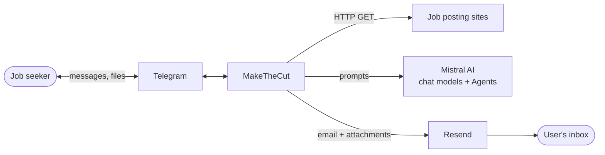
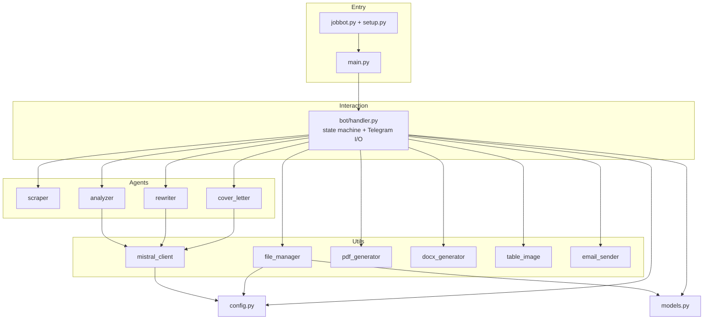
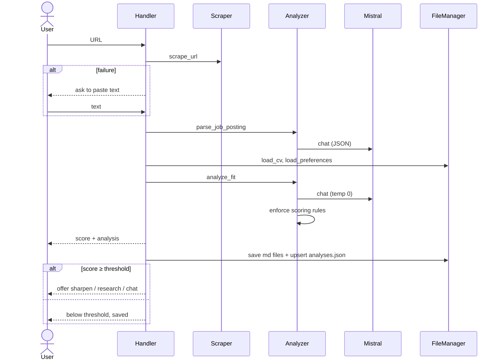
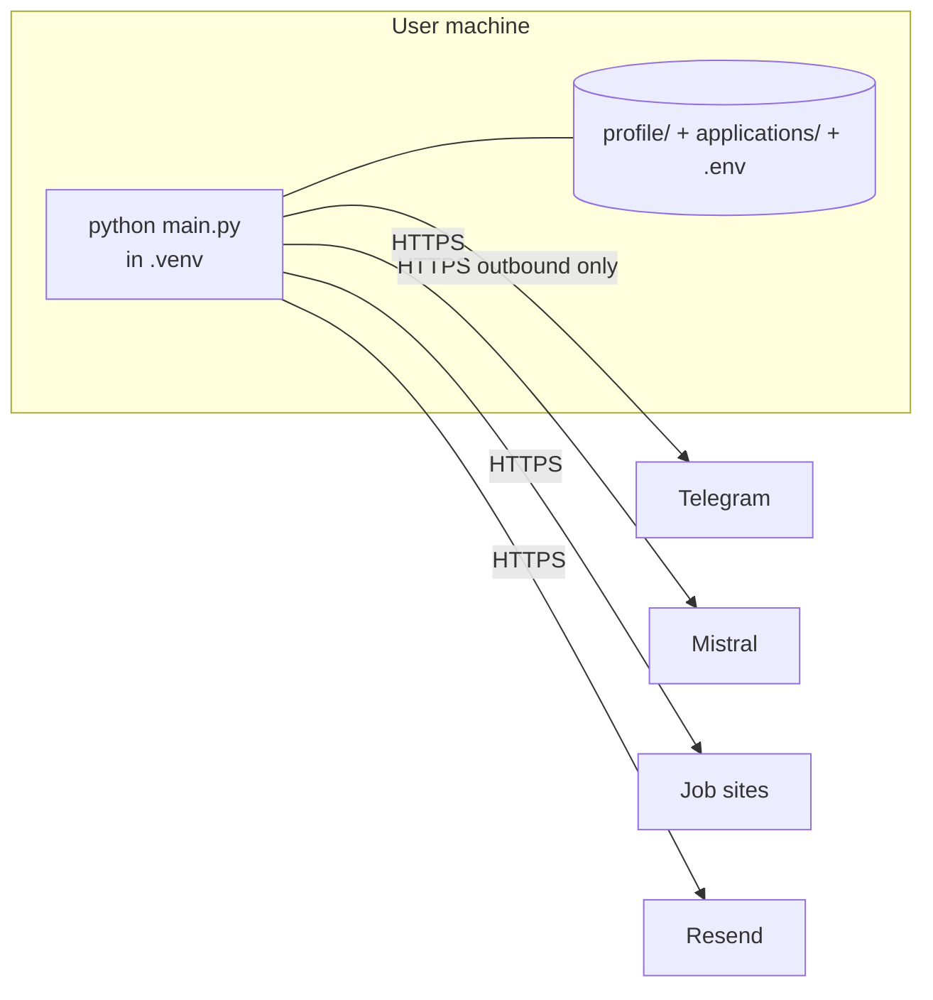

# MakeTheCut: Architecture Documentation (arc42)

> 🚧 Work in progress. This document describes the current implementation and planned changes. It follows the [arc42](https://arc42.org) template.

---

## 1. Introduction and Goals

### 1.1 Requirements overview

MakeTheCut is a single-user Telegram bot that helps a job seeker decide which roles are worth applying to, and then speeds up the application.

| # | Requirement |
|---|---|
| R1 | Accept a job posting URL, or pasted text when scraping fails. |
| R2 | Extract structured data from the posting (company, role, requirements, language, contact…). |
| R3 | Score the fit (0–100) against the user's CV and preferences, with a transparent component breakdown. |
| R4 | Surface dealbreakers, red flags and contradictions in the posting itself. |
| R5 | For roles above a threshold: research the company, tailor the CV and draft a cover letter in the posting's language. |
| R6 | Deliver documents as PDF or DOCX in Telegram, or by email. |
| R7 | Keep a persistent history; support `/list` and `/ask` across all analyses. |
| R8 | Support free-form chat about the current job. |

### 1.2 Quality goals

| Priority | Goal | Scenario |
|---|---|---|
| 1 | **Honesty / trustworthiness of scores** | The same posting and CV give the same score. Unstated skills are never credited. A dealbreaker can never yield a score above 49. |
| 2 | **No fabrication in documents** | The tailored CV only reorders and rephrases facts that are in the original CV. |
| 3 | **Privacy / local-first** | Personal data stays on the user's machine except for prompts sent to Mistral. |
| 4 | **Simplicity and operability** | One process, no server, one command to start. |
| 5 | **Resilience** | Scrape failures, model timeouts and unparseable model output never crash the bot. |

### 1.3 Stakeholders

| Role | Expectation |
|---|---|
| Job seeker (the owner and only user) | Fast, honest triage of postings. Good application material. Control over data. |
| Developer / contributor | Readable code, easy-to-change prompts and scoring rules. |
| Third-party providers (Telegram, Mistral, Resend) | Usage within their terms. |

---

## 2. Architecture Constraints

| Type | Constraint |
|---|---|
| Technical | Python 3.10+. macOS or Linux for the bundled launcher (`.venv/bin/...` paths). |
| Technical | Telegram long-polling. No inbound ports, webhooks or hosting. |
| Technical | LLM provider is Mistral (chat completions and Agents API with web search). |
| Organisational | Personal, single-user project. No SLA. Work in progress. |
| Legal / privacy | CV and job text are processed by Mistral's API. Output carries no correctness guarantee. |
| Convention | Persistence in plain files (JSON, CSV, Markdown). No database. |

---

## 3. Context and Scope

### 3.1 Business context

| Partner | Inputs to MakeTheCut | Outputs from MakeTheCut |
|---|---|---|
| User (via Telegram) | URLs, pasted text, commands, replies, photo | Scores, analyses, tables, PDF/DOCX files |
| Job posting sites | HTML | HTTP GET with browser-like headers |
| Mistral AI | Completions, agent answers | Prompts containing CV, preferences and job text |
| Resend | Delivery status | HTML email with optional attachments |

### 3.2 Technical context

| Interface | Protocol | Notes |
|---|---|---|
| Telegram Bot API | HTTPS, long polling (`python-telegram-bot`) | Token from `.env`. Text, photo and document updates. |
| Mistral Chat API | HTTPS (`mistralai` SDK, `chat.complete`) | Model from `MISTRAL_MODEL`. 45 s SDK timeout. |
| Mistral Agents API | HTTPS (`beta.conversations.start`) | Agent from `MISTRAL_AGENT_ID` with web search. Two attempts. |
| Job sites | HTTPS GET (`requests`) | 15 s timeout, text capped at 15,000 characters. |
| Resend API | HTTPS (`resend` SDK) | Optional. Needs `RESEND_API_KEY` and `RESEND_TO`. |
| Local filesystem | Files | `profile/` (input), `applications/` (output). |

---

## 4. Solution Strategy

| Goal | Approach |
|---|---|
| Trustworthy scoring | Rubric-based prompt, `temperature=0`, strict recruiter persona. Component scores are clamped and re-summed in code (`_enforce_scoring_rules`), and the dealbreaker cap is applied in code. |
| No fabrication | Rewriter prompt forbids new facts. Only the CV in `profile/cv.md` is passed as truth. |
| Simplicity | Single process, in-memory session, flat-file persistence, thin Mistral client. |
| Responsiveness | Blocking calls (HTTP, LLM, PDF) run via `asyncio.to_thread`. Progress messages and typing indicators keep the user informed. |
| Resilience | Typed fallbacks for unparseable JSON, scrape failure → paste flow, retries for the agent, timeouts at SDK and handler level. |
| Low cost | Web-search agent used only for explicit company research. Everything else uses plain chat completions. |
| Maintainability | One module per agent task. Pydantic models define the persisted schema, and the JSON Schema is regenerated automatically. |

---

## 5. Building Block View

### 5.1 Level 1: whitebox

| Building block | Responsibility |
|---|---|
| `main.py` | Builds the Telegram `Application`, registers handlers, syncs bot description and command list at startup, writes the JSON schema, starts polling. |
| `jobbot.py`, `setup.py` | Launcher. Creates or refreshes `.venv` (keyed by a hash of `requirements.txt`), then runs `main.py`. |
| `config.py` | Reads `.env`, defines constants and paths, creates working directories. |
| `models.py` | Pydantic schemas for the persisted data. |
| `bot/handler.py` | Owns the session `_state` and routes messages by status. Orchestrates the pipeline, chat mode, document and email flows, and `/list`, `/ask`, `/email`, `/reset`, `/continue`, `/help`, `/start`. |
| `agents/scraper.py` | URL detection and HTML → clean text. |
| `agents/analyzer.py` | `parse_job_posting`, `analyze_fit`, `research_company`, `ask_agent`. |
| `agents/rewriter.py` | `rewrite_cv`. |
| `agents/cover_letter.py` | `write_cover_letter` with language selection. |
| `utils/mistral_client.py` | `simple_chat` and `agent_chat` over a lazily created, shared SDK client. |
| `utils/file_manager.py` | Profile loading, folder creation, file writes, record upsert, Q&A log, conversation log, schema export. |
| `utils/pdf_generator.py`, `utils/docx_generator.py` | Markdown → PDF / DOCX, with optional photo. |
| `utils/table_image.py` | Renders the job table as a PNG for `/list`. |
| `utils/email_sender.py` | Builds and sends the HTML email, with attachments if requested. |

### 5.2 Level 2: `agents/analyzer.py`

| Function | Input → Output | Notes |
|---|---|---|
| `parse_job_posting` | raw text → job dict | First 12,000 characters. JSON-only prompt. Fallback record on parse failure. |
| `analyze_fit` | job, CV, preferences → analysis dict | CV truncated to 4,000 and preferences to 1,500 characters. `temperature=0`. Post-processed by `_enforce_scoring_rules`. |
| `research_company` | job → `(text, error)` | Uses the Mistral Agent (web search). Optional step. |
| `ask_agent` | question, records, CV, preferences → answer | De-duplicates analyses per (company, role), keeps the 15 most recent. Plain chat, no web search. |

---

## 6. Runtime View

### 6.1 Scenario: analyse a job

### 6.2 Scenario: sharpen

1. User replies `sharpen` (optionally after `research`).
2. `rewrite_cv()` and `write_cover_letter()` run in worker threads.
3. Texts are stored in session state immediately.
4. User chooses `cv`, `letter` or `both`, then `pdf` or `docx`.
5. If a PDF CV contains image references, the bot asks for a photo or `skip`.
6. Files are sent in Telegram. The bot then offers to email them.

### 6.3 Scenario: ask across analyses

`/ask <question>` loads all records, builds one context block (CV + preferences + summaries) and sends it to a plain chat call. The Q&A pair is appended to `qa_log.json`.

### 6.4 Error handling at runtime

| Failure | Behaviour |
|---|---|
| Scrape error or too little content | Bot asks the user to paste the text. |
| Model returns invalid JSON | Fallback record. For fit analysis the score is 0 with a "Parsing error" flag. |
| Mistral timeout | SDK error surfaces first, then the handler-level timeout (30 s chat / 50 s agent) as a backstop. The user gets an error message and a way forward. |
| Agent call error | One retry, then the error is reported and the pipeline continues without research. |
| Missing CV or preferences | Clear error message, session reset. |

---

## 7. Deployment View

- One long-running process, started with `python jobbot.py`. No inbound connectivity is needed.
- State is held in the process. Restarting resets the session but not the saved history.
- Any machine with Python 3.10+ and outbound HTTPS works. A small VM or Raspberry Pi would also do. Containerisation is not provided yet.
- Secrets live in `.env` (git-ignored).

---

## 8. Cross-cutting Concepts

### 8.1 Domain model

`ApplicationRecord` → `JobInfo` (with `ContactInfo`) + `FitAnalysis` (with `ScoreBreakdown`, `Strength`, `Weakness`, `PreferenceAlignment`) + flags (`cv_rewritten`, `cover_letter_generated`). `QARecord` stores `/ask` exchanges. The canonical JSON Schema is regenerated into `applications/analyses.schema.json`.

### 8.2 Scoring model

| Component | Max |
|---|---|
| Must-have requirements | 40 |
| Experience and seniority | 30 |
| Preferences and logistics | 20 |
| Responsibilities and nice-to-haves | 10 |

`fit_score = sum(components)`, capped at **49** if any dealbreaker exists. Threshold for sharpen: **70**.

### 8.3 Session and concurrency

A single module-level `_state` dict models one conversation with one user. This is deliberate for a personal tool and means concurrent users would interfere with each other. See risks.

### 8.4 Persistence

JSON for structured records (upsert by `id`), CSV for the message log, Markdown for per-application artefacts. Folder names use `YYYY-MM-DD_Company_Role` with sanitised, length-limited segments.

### 8.5 Prompting conventions

- JSON-only system prompts for extraction and scoring, tolerant parser that strips Markdown fences.
- Explicit inputs with truncation limits to bound prompt size.
- Output language derived from the ISO code detected in the posting.

### 8.6 Security and privacy

- Secrets in `.env`, never committed.
- Personal data (`profile/`, `applications/`) git-ignored.
- Data leaving the machine: prompts to Mistral, optional email to Resend.
- **Planned:** restrict the bot to `AUTHORIZED_USER_ID`. The value is loaded but not enforced yet.

### 8.7 Logging and observability

Python `logging` to stdout, startup timing markers, raw model responses logged (truncated to 500 characters). Chat logs go to `applications/conversations.csv`.

### 8.8 Internationalisation

Cover letters follow the posting language. Reply keywords accept several languages (e.g. `oui`, `sí`, `ja`). UI messages are in English.

---

## 9. Architecture Decisions

| ID | Decision | Rationale | Consequence |
|---|---|---|---|
| ADR-1 | Telegram as the UI | No frontend to build. Works on phone, trivial notifications and file delivery. | Tied to Telegram's UX and rate limits. |
| ADR-2 | Long polling, local process | No hosting, no open ports. | Bot is only available while the process runs. |
| ADR-3 | Mistral for all LLM work | Single provider and SDK, agents with built-in web search, EU-based provider. | Provider lock-in. Model behaviour changes can shift scores. |
| ADR-4 | Recompute the score in code | LLM arithmetic is unreliable, and dealbreaker rules must be absolute. | The model's `fit_score` is advisory only. |
| ADR-5 | `temperature=0` for scoring | Repeatability. | Less variety, but that is intended here. |
| ADR-6 | Agent (web search) only for research | Cost and latency. Scoring should depend on CV and posting only. | Company insights are opt-in. |
| ADR-7 | Flat files instead of a database | Zero setup, human-readable, easy to back up. | No concurrent writers, no indexing. Fine for hundreds of records. |
| ADR-8 | Single in-memory session | Personal tool, simplest possible state handling. | Not multi-user. State lost on restart. |
| ADR-9 | Rewriter may not add facts | Protects the user from sending false claims. | Gaps stay visible instead of being papered over. |

---

## 10. Quality Requirements

### 10.1 Quality tree

- **Correctness and trust:** deterministic scoring, bounded scores, evidence-based strengths, no fabricated CV content.
- **Usability:** short conversational flow, progress feedback, recoverable errors (`/continue`, `/reset`).
- **Privacy:** local storage, git-ignored personal data, minimal outbound calls.
- **Operability:** one-command start, self-healing venv, readable logs.
- **Modifiability:** prompts and weights are isolated constants in a few modules.

### 10.2 Quality scenarios

| ID | Scenario | Expected response |
|---|---|---|
| Q1 | Same CV and posting analysed twice | Scores are identical or within a few points. |
| Q2 | Posting lists a mandatory certification the CV lacks | Dealbreaker is raised and the score is ≤ 49. |
| Q3 | Model returns text around the JSON | Parser strips fences. Otherwise a safe fallback is used, with no crash. |
| Q4 | Job site blocks scraping | Bot asks for pasted text within one message. |
| Q5 | Mistral call exceeds the timeout | User sees an error and can retry, and the session stays usable. |
| Q6 | Dependencies change | `python jobbot.py` rebuilds the venv automatically. |

---

## 11. Risks and Technical Debt

| ID | Item | Impact | Mitigation / next step |
|---|---|---|---|
| T1 | **Access control not implemented**: `AUTHORIZED_USER_ID` is loaded but unused | Anyone who finds the bot can use it and read saved analyses | Planned: enforce in every handler, ideally via a Telegram handler filter. |
| T2 | LLM output may be wrong or inconsistent | Misleading scores or documents | Disclaimer, deterministic rules, user review. No automated evaluation yet. |
| T3 | Single global session | Concurrent users would clash | Key session by user ID if multi-user is ever needed. |
| T4 | `bot/handler.py` is large (~1,200 lines) and mixes flow, formatting and I/O | Harder to test and change | Split into state handlers, presenters and delivery modules. |
| T5 | No automated tests | Regressions go unnoticed | Unit tests for `_enforce_scoring_rules`, parsers, scraper. Golden tests for prompts. |
| T6 | Scraping is brittle (JS-rendered or login-gated sites) | Frequent manual paste | Optional headless-browser fallback. |
| T7 | Prompt truncation (CV 4,000 and 3,000 characters in different calls) | Long CVs may lose content in scoring | Make limits configurable, or summarise first. |
| T8 | Launcher assumes POSIX venv paths | Not Windows-friendly | Use `sys.executable` and `venv` scripts directory detection. |
| T9 | Personal data in prompts sent to a third party | Privacy exposure | Documented. Consider a redaction step. |
| T10 | Import-timing debug code in `handler.py` and `main.py` | Noise | Remove once startup performance is settled. |

---

## 12. Glossary

| Term | Meaning |
|---|---|
| Fit score | 0–100 rating of how well a candidate matches a posting. |
| Dealbreaker | A hard blocker (e.g. unmet mandatory requirement) that caps the score at 49. |
| Sharpen | Tailoring the CV and drafting a cover letter for a specific job. |
| Threshold | Minimum score (default 70) that unlocks sharpen. |
| Mistral Agent | A Mistral-hosted agent configured with tools such as web search, called via the Conversations API. |
| Application record | The persisted analysis of one job in `analyses.json`. |
| Session / state | The in-memory status and data for the current conversation. |
| arc42 | A template for documenting software architecture. |
